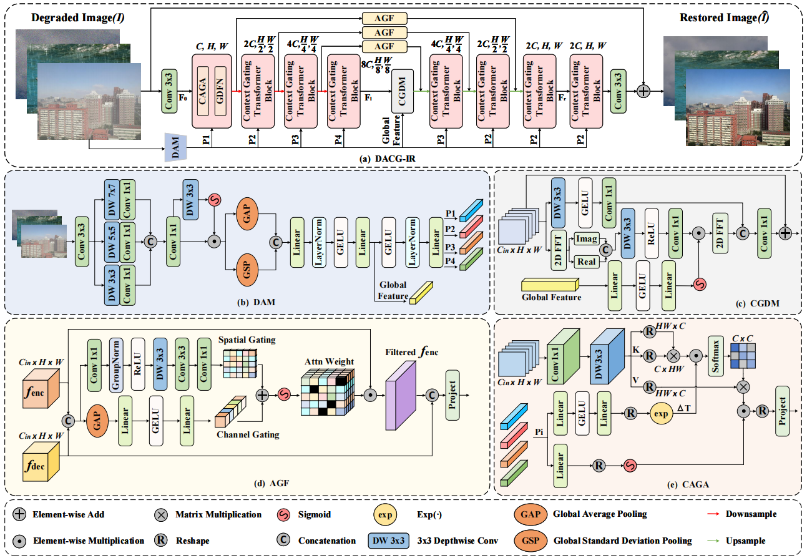
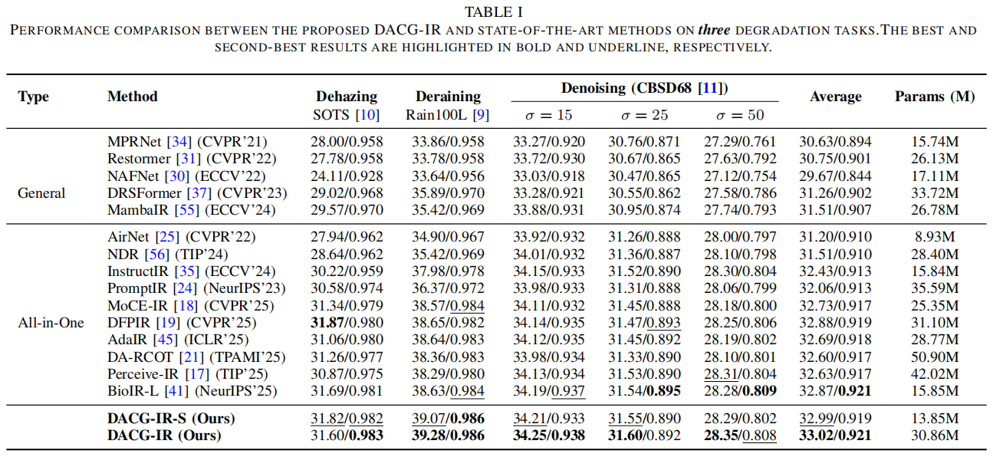
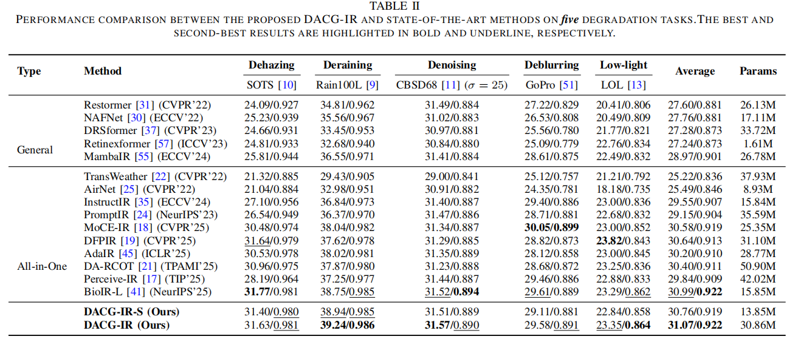

# Degradation-Aware Adaptive Context Gating for Unified Image Restoration (DACG-IR)

**Authors:** Lei He, Jielei Chu*, Fengmao Lv, Weide Liu, Tianrui Li, Jun Cheng, Yuming Fang  
**\* Corresponding Author**

<details>
  <summary>
  <font size="+1">Abstract</font>
  </summary>
Unified image restoration aims to handle diverse degradation types using a single model. However, the significant variability across different degradations often leads to severe task interference and suboptimal performance. Existing methods often struggle to balance task-specific discriminability with inter-task generalization, leading to either negative interference in complex environments or suboptimal performance on specific degradations. To overcome these challenges, we propose a Degradation-Aware Adaptive Context Gating (DACG-IR), which enables the restoration model to explicitly perceive degradation characteristics and dynamically modulate feature representations conditioned on the input image. The core idea is to construct degradation-aware contextual representations directly from the input image and utilize them to modulate attention distribution, frequency-domain modulation, and feature aggregation throughout the model. This design enables the model to suppress degradation-induced noise and interference while preserving informative image structures. Specifically, we design a lightweight multi-scale degradation-aware module to extract coarse degradation information and generate layer-wise degradation prompts, which guide the attention temperature and attention output gating in different blocks of the encoder and decoder, enabling adaptive feature extraction and fusion across scales. The generated global feature prompts is further used to dynamically modulate high-dimensional latent features. Furthermore, a spatial-channel dual-gated adaptive fusion mechanism is designed to refine encoder features and suppress the propagation of noise or irrelevant background information from shallow layers to deeper representations, thereby promoting high-fidelity reconstruction in the decoder. Extensive experiments on multiple benchmark datasets show that DACG-IR consistently outperforms state-of-the-art image restoration methods under single-task, all-in-one, adverse weather removal, and composite degradation settings. 

</details>

## Architecture 

## Results
<br>
<details>
  <summary>
  <font>**Three-task All-in-One Restoration:** Haze, Rain, Noise.</font>
  </summary>
  <p align="center">
  
  </p>
</details>
<br>
<details>
  <summary>
  <font> **Five-task All-in-One Restoration:** Haze, Rain, Noise, Blur, Low Light.</font>
  </summary>
  <p align="center">
  
  </p>
</details>
*  

## Installation

1.  **Clone the repository:**
    ```bash
    git clone https://github.com/HlHomes/DACG-IR-code.git
    cd DACG-IR-code
    ```

2.  **Create a Conda environment:**
    ```bash
    ENV_NAME="DACG-IR"
    conda create -n $ENV_NAME python=3.10
    conda activate $ENV_NAME
    ```

3.  **Install dependencies:**
    ```bash
    bash install.sh
    ```

## Testing

Performance results are generated using the `src/test.py` script. 
*   `--model`: Set to `DACG-IR` or `DACG-IR-S`.
*   `--benchmarks`: Accepts a list of strings to iterate over defined test sets.
*   `--checkpoint_id`: Path to the pre-trained model.
*   `--de_type`: Denotes degradation type.
*   `--data_file_dir`: Your dataset directory.

### All-in-One Testing

**Three Tasks:**
```bash
python src/test.py --model "model" --benchmarks benchmarks --checkpoint_id "checkpoint_id" --de_type denoise_15 denoise_25 denoise_50 dehaze derain --data_file_dir "data_file_dir"
```

**Five Tasks:**
```bash
python src/test.py --model "$model" --benchmarks $benchmarks --checkpoint_id "${checkpoint_id}" --de_type denoise_15 denoise_25 denoise_50 dehaze derain deblur synllie --data_file_dir "data_file_dir"
```

### Multi-Weather and Signal Degradation
```bash
python test.py --dataset "dataset"
```
*(For specific settings, please refer to `./test.py`)*

### CDD11: Composited Degradations
Replace `[DEG_CONFIG]` with the desired configuration:
*   **Single:** `low`, `haze`, `rain`, `snow`
*   **Double:** `low_haze`, `low_rain`, `low_snow`, `haze_rain`, `haze_snow`
*   **Triple:** `low_haze_rain`, `low_haze_snow`

```bash
python src/test.py --model [MODEL] --checkpoint_id [MODEL]_CDD11 --trainset CDD11_[DEG_CONFIG] --benchmarks cdd11 --de_type denoise_15 denoise_25 denoise_50 dehaze derain deblur synllie --data_file_dir "data_file_dir"
```

## Training

You can train the lightweight (`DACG-IR-S`) or heavy (`DACG-IR`) versions on three or five degradations.
*   `--gpus`: Specify number of GPUs (`1` for single, `>1` for multiple).
*   `--batch_size`: Defines batch size **per GPU**.
*   *Note: Networks were trained on 4x NVIDIA Tesla A100.*

### All-in-One Training
```bash
python src/train.py --model model --batch_size 8 --de_type synllie --trainset standard --num_gpus 4 --data_file_dir data_file_dir
```

### Multi-Weather or Signal Degradation Training
```bash
python train.py --dataset allweather --batch_size 8 --patch_size 256 --num_gpus 4 --data_file_dir data_file_dir
```

### CDD11: Composited Degradations Training
Train from scratch on the [CDD11](https://github.com/gy65896/OneRestore) dataset:
*   `CDD_single`: Low light (L), Haze (H), Rain (R), Snow (S)
*   `CDD_double`: L+H, L+R, L+S, H+R, H+S
*   `CDD_triple`: L+H+R, L+H+S
*   `--trainset CDD_all`: Combines Single + Double + Triple

```bash
python src/train.py --model model_s --batch_size 8 --de_type denoise_15 denoise_25 denoise_50 dehaze derain --trainset CDD11_all --num_gpus 4 --data_file_dir data_file_dir
```

## Acknowledgements
This code is built upon:
* [PromptIR](https://github.com/va1shn9v/PromptIR)

* Here is the organized English version of the README.md file based on the content provided.

    ***

    # Degradation-Aware Adaptive Context Gating for Unified Image Restoration (DACG-IR)

    **Authors:** Lei He, Jielei Chu*, Fengmao Lv, Weide Liu, Tianrui Li, Jun Cheng, Yuming Fang  
    **\* Corresponding Author**

    ## Abstract
    Unified image restoration aims to handle diverse degradation types using a single model. However, significant variability across different degradations often leads to severe task interference and suboptimal performance. Existing methods struggle to balance task-specific discriminability with inter-task generalization, resulting in either negative interference in complex environments or poor performance on specific degradations.

    To overcome these challenges, we propose **Degradation-Aware Adaptive Context Gating (DACG-IR)**. This method enables the restoration model to explicitly perceive degradation characteristics and dynamically modulate feature representations conditioned on the input image. 

    **Key Features:**
    *   **Degradation-Aware Context:** Constructs contextual representations directly from the input image to modulate attention distribution, frequency-domain modulation, and feature aggregation.
    *   **Lightweight Multi-Scale Module:** Extracts coarse degradation information to generate layer-wise degradation prompts. These guide attention temperature and output gating in encoder/decoder blocks for adaptive feature extraction.
    *   **Global Feature Prompts:** Dynamically modulate high-dimensional latent features.
    *   **Spatial–Channel Dual-Gated Fusion:** Refines encoder features and suppresses noise propagation from shallow to deep layers, promoting high-fidelity reconstruction.

    Extensive experiments demonstrate that DACG-IR consistently outperforms state-of-the-art methods in single-task, all-in-one, adverse weather removal, and composite degradation settings.

    ## Architecture & Results
    The framework supports:
    *   **Three-task All-in-One Restoration:** Haze, Rain, Noise.
    *   **Five-task All-in-One Restoration:** Haze, Rain, Noise, Blur, Low Light.

    ## Installation

    1.  **Clone the repository:**
        ```bash
        git clone https://github.com/HlHomes/DACG-IR-code.git
        cd DACG-IR-code
        ```

    2.  **Create a Conda environment:**
        ```bash
        ENV_NAME="DACG-IR"
        conda create -n $ENV_NAME python=3.10
        conda activate $ENV_NAME
        ```

    3.  **Install dependencies:**
        ```bash
        bash install.sh
        ```

    ## Testing

    Performance results are generated using the `src/test.py` script. 
    *   `--model`: Set to `DACG-IR` or `DACG-IR-S`.
    *   `--benchmarks`: Accepts a list of strings to iterate over defined test sets.
    *   `--checkpoint_id`: Path to the pre-trained model.
    *   `--de_type`: Denotes degradation type.
    *   `--data_file_dir`: Your dataset directory.

    ### All-in-One Testing

    **Three Tasks:**
    ```bash
    python src/test.py --model "model" --benchmarks benchmarks --checkpoint_id "checkpoint_id" --de_type denoise_15 denoise_25 denoise_50 dehaze derain --data_file_dir "data_file_dir"
    ```

    **Five Tasks:**
    ```bash
    python src/test.py --model "$model" --benchmarks $benchmarks --checkpoint_id "${checkpoint_id}" --de_type denoise_15 denoise_25 denoise_50 dehaze derain deblur synllie --data_file_dir "data_file_dir"
    ```

    ### Multi-Weather and Signal Degradation
    ```bash
    python test.py --dataset "dataset"
    ```
    *(For specific settings, please refer to `./test.py`)*

    ### CDD11: Composited Degradations
    Replace `[DEG_CONFIG]` with the desired configuration:
    *   **Single:** `low`, `haze`, `rain`, `snow`
    *   **Double:** `low_haze`, `low_rain`, `low_snow`, `haze_rain`, `haze_snow`
    *   **Triple:** `low_haze_rain`, `low_haze_snow`

    ```bash
    python src/test.py --model [MODEL] --checkpoint_id [MODEL]_CDD11 --trainset CDD11_[DEG_CONFIG] --benchmarks cdd11 --de_type denoise_15 denoise_25 denoise_50 dehaze derain deblur synllie --data_file_dir "data_file_dir"
    ```

    ## Training

    You can train the lightweight (`DACG-IR-S`) or heavy (`DACG-IR`) versions on three or five degradations.
    *   `--gpus`: Specify number of GPUs (`1` for single, `>1` for multiple).
    *   `--batch_size`: Defines batch size **per GPU**.
    *   *Note: Networks were trained on 4x NVIDIA Tesla A100.*

    ### All-in-One Training
    ```bash
    python src/train.py --model model --batch_size 8 --de_type synllie --trainset standard --num_gpus 4 --data_file_dir data_file_dir
    ```

    ### Multi-Weather or Signal Degradation Training
    ```bash
    python train.py --dataset allweather --batch_size 8 --patch_size 256 --num_gpus 4 --data_file_dir data_file_dir
    ```

    ### CDD11: Composited Degradations Training
    Train from scratch on the [CDD11](https://github.com/gy65896/OneRestore) dataset:
    *   `CDD_single`: Low light (L), Haze (H), Rain (R), Snow (S)
    *   `CDD_double`: L+H, L+R, L+S, H+R, H+S
    *   `CDD_triple`: L+H+R, L+H+S
    *   `--trainset CDD_all`: Combines Single + Double + Triple

    ```bash
    python src/train.py --model model_s --batch_size 8 --de_type denoise_15 denoise_25 denoise_50 dehaze derain --trainset CDD11_all --num_gpus 4 --data_file_dir data_file_dir
    ```

    ## Acknowledgements
    This code is built upon:
    *   [PromptIR](https://github.com/va1shn9v/PromptIR)
    *   [AirNet](https://github.com/XLearning-SCU/2022-CVPR-AirNet)
    *   [MoCE-IR](https://eduardzamfir.github.io/moceir/)
